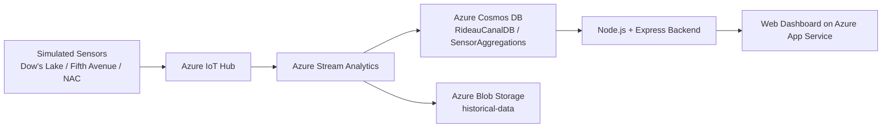

# Real-time Monitoring System for Rideau Canal Skateway

## Student Information

- **Name:** Ilyas Zazai
- **Student ID:** 041173490
- **Course:** CST8916 - Remote Data and Real-time Applications
- **Project:** Final Project - Real-time Monitoring System for Rideau Canal Skateway

---

## Project Description

This project is a cloud-based real-time monitoring system for the Rideau Canal Skateway in Ottawa.

The system simulates IoT sensors at three locations and streams telemetry through Azure services. The data is processed in real time, stored for fast dashboard access, archived for historical review, and displayed in a live web dashboard.

The monitored locations are:

- **Dow's Lake**
- **Fifth Avenue**
- **NAC**

The monitored conditions are:

- Ice Thickness (cm)
- Surface Temperature (°C)
- Snow Accumulation (cm)
- External Temperature (°C)

---

## Repository Links

### Links Repository
- **URL:** https://github.com/Ilyzazai/rideau-canal-monitoring/blob/main/LINKS.md

### Sensor Simulation Repository
- **URL:** https://github.com/Ilyzazai/rideau-canal-sensor-simulation

### Web Dashboard Repository
- **URL:** https://github.com/Ilyzazai/rideau-canal-dashboard

### Video Demo
- **URL:** https://www.youtube.com/watch?v=leEt8jrVxto

---

## Scenario Overview

The Rideau Canal Skateway is a major public attraction and requires regular monitoring to help support skater safety. In this project, I built a real-time monitoring pipeline that simulates sensor readings, processes data in Azure, stores results, and displays the latest conditions in a dashboard.

### System Objectives

- simulate sensor data for three skating locations
- ingest telemetry using Azure IoT Hub
- process the stream using Azure Stream Analytics
- aggregate sensor data in 5-minute tumbling windows
- store processed data in Azure Cosmos DB
- archive historical results in Azure Blob Storage
- display live information in a web dashboard hosted on Azure App Service

---

## System Architecture

### Architecture Diagram

Add your architecture image here:

`architecture/architecture-diagram.png`

### Architecture Flow

### Data Flow Explanation

Simulated IoT sensors generate telemetry every 10 seconds for the three Rideau Canal locations.  
Azure IoT Hub receives the incoming sensor messages.  
Azure Stream Analytics reads the incoming stream and processes it using a 5-minute tumbling window.  
Aggregated values are calculated for each location.  
Safety status is classified as Safe, Caution, or Unsafe.  
Processed data is written to Azure Cosmos DB for fast dashboard access.  
The same processed data is also archived in Azure Blob Storage for historical retention.  
The dashboard backend reads the latest and historical data from Cosmos DB.  
The frontend displays current conditions, safety status, and trend charts.

### Azure Services Used

#### Azure IoT Hub
Used for telemetry ingestion from the simulated sensors.

- **Name:** `rideau-canal-iothub-ilyas`

#### Azure Stream Analytics
Used for real-time stream processing and data aggregation.

- **Name:** `rideau-canal-stream-job`

#### Azure Cosmos DB
Used as the main NoSQL database for dashboard queries.

- **Account Name:** `ilyascosmosdb`
- **Database:** `RideauCanalDB`
- **Container:** `SensorAggregations`
- **Partition Key:** `/location`

#### Azure Blob Storage
Used for historical archival of processed aggregation output.

- **Storage Account:** `rideaucanalstorageilyas`
- **Container:** `historical-data`

#### Azure App Service
Used to host the live web dashboard.

- **Web App Name:** `rideau-canal-dashboard-ilyas`

#### Resource Group
- **Name:** `rideau-canal-rg`

---

## Implementation Overview

### 1. IoT Sensor Simulation

The sensor simulator sends JSON telemetry every 10 seconds for:

- Dow's Lake
- Fifth Avenue
- NAC

Each message includes:

- `timestamp`
- `location`
- `ice thickness`
- `surface temperature`
- `snow accumulation`
- `external temperature`

### 2. Stream Analytics Processing

The Stream Analytics job processes incoming data using a 5-minute tumbling window.

The following aggregations are calculated:

- average ice thickness
- min ice thickness
- max ice thickness
- average surface temperature
- min surface temperature
- max surface temperature
- maximum snow accumulation
- average external temperature
- reading count

### 3. Safety Status Logic

The dashboard uses the following logic:

- **Safe:** ice thickness ≥ 30 cm and surface temperature ≤ -2 °C
- **Caution:** ice thickness ≥ 25 cm and surface temperature ≤ 0 °C
- **Unsafe:** all other conditions

### 4. Cosmos DB Setup

Processed results are stored in Cosmos DB for fast dashboard reads.

Confirmed data structure includes fields such as:

- `id`
- `location`
- `windowEnd`
- `avgIceThicknessCm`
- `minIceThicknessCm`
- `maxIceThicknessCm`
- `avgSurfaceTemperatureC`
- `minSurfaceTemperatureC`
- `maxSurfaceTemperatureC`
- `maxSnowAccumulationCm`
- `avgExternalTemperatureC`
- `readingCount`
- `safetyStatus`

### 5. Blob Storage Configuration

Processed data is also archived in Blob Storage for historical records and long-term storage.

### 6. Web Dashboard

The web dashboard was built using:

- Node.js
- Express
- `@azure/cosmos`
- HTML
- CSS
- JavaScript
- Chart.js

Implemented dashboard features:

- 3 live location cards
- safety status badges
- overall system status
- historical trend chart for the last hour
- auto-refresh every 30 seconds

### 7. Azure App Service Deployment

The dashboard was deployed to Azure App Service as a live web application.

Deployment summary:

- created a Linux Node.js Web App
- configured Cosmos DB environment variables
- set startup command to `npm start`
- deployed the dashboard successfully
- verified the live dashboard in Azure

---

## Setup Instructions

### Prerequisites

- Azure subscription
- Python 3
- Node.js and npm
- Azure CLI
- Git
- GitHub account

### High-Level Setup Steps

1. Create Azure resources:
   - IoT Hub
   - Stream Analytics
   - Cosmos DB
   - Blob Storage
   - App Service
2. Configure the IoT devices and run the sensor simulator.
3. Configure the Stream Analytics job and start it.
4. Verify that aggregated data is reaching Cosmos DB.
5. Verify that historical output is written to Blob Storage.
6. Run the dashboard locally.
7. Deploy the dashboard to Azure App Service.

For detailed setup and code instructions, see the other two repositories.

---

## Results and Analysis

### Successful Pipeline Flow

The completed system followed this flow successfully:

- simulated sensors generated telemetry every 10 seconds
- Azure IoT Hub received the messages
- Stream Analytics processed the data
- Cosmos DB stored aggregated records
- Blob Storage archived historical output
- the dashboard displayed live conditions and historical trends

### Dashboard Results

The final dashboard displayed:

- the latest data for all three locations
- safety status badges
- overall system status
- historical ice thickness trends for the last hour
- automatic refresh every 30 seconds

### Data Analysis

The project design used 5-minute tumbling windows to reduce noise and produce stable aggregated values for the dashboard.

Observations:

- frequent sensor telemetry created enough data for meaningful stream processing
- aggregation simplified the dashboard view
- Cosmos DB provided fast read access for latest results
- Blob Storage separated archival data from live query data

### System Performance Observations

- the simulator frequency was suitable for continuous monitoring
- per-location aggregation kept the data organized
- the latest-per-location API design worked reliably with the `/location` partition key
- the Azure-hosted dashboard successfully read live data from Cosmos DB

---

## Challenges and Solutions

### 1. Backend latest-data query issue

**Challenge:**  
The `/api/latest` route did not initially return the correct latest data.

**Solution:**  
The backend was rebuilt cleanly and simplified. The final solution used one Cosmos DB query per location with `TOP 1` and `ORDER BY c.windowEnd DESC`.

### 2. Dashboard reset

**Challenge:**  
Earlier dashboard code had become difficult to debug reliably.

**Solution:**  
The dashboard folder was recreated from scratch and rebuilt step by step.

### 3. Azure App Service startup problem

**Challenge:**  
After deployment, the site stayed in the startup phase.

**Solution:**  
The startup command was correctly set to `npm start` in Azure App Service, and the application started successfully.

### 4. ZIP packaging issue in WSL

**Challenge:**  
The normal zip utility installation in WSL ran into repository and timeout issues.

**Solution:**  
The deployment ZIP file was created using Python instead.

---

## AI Tools Used

- **Tool:** ChatGPT
- **Purpose:** code generation, debugging, understanding concepts, deployment troubleshooting, and documentation writing
- **Extent:** AI was used to help generate and refine parts of the dashboard backend, frontend structure, deployment steps, and documentation drafts. Final Azure configuration, validation, testing, debugging decisions, and understanding of the code were completed by me.
- **Verification:** all AI-assisted output was reviewed, tested, and adjusted before submission.

---

## References

### Technologies and Services

- Azure IoT Hub
- Azure Stream Analytics
- Azure Cosmos DB
- Azure Blob Storage
- Azure App Service
- Node.js
- Express
- Chart.js
- Python

### Course Reference

- CST8916 Final Project Assignment
